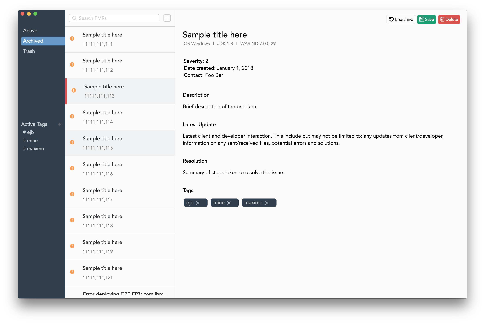

# A spicy PMR manager

A personal PMR management tool that tracks your PMR activity.




## Prerequisites 

- Node


## Installation

First, clone the repository:

```
git clone https://github.com/Kubik42/pmr-manager
```

Then navigate into it and run:

```
npm install
```

This will pull in all node dependencies for you including Electron. Once thats finished, the app can be started with: 

```
npm start
```

**Currently only tested on Macs (Windows definitely requires a separate installer to work)**

## TODO:

**Must**
- File attatchements
- Properly render newlines

**Bugs**
- links go offscreen?

**Bonus**
- Sorting via tags
